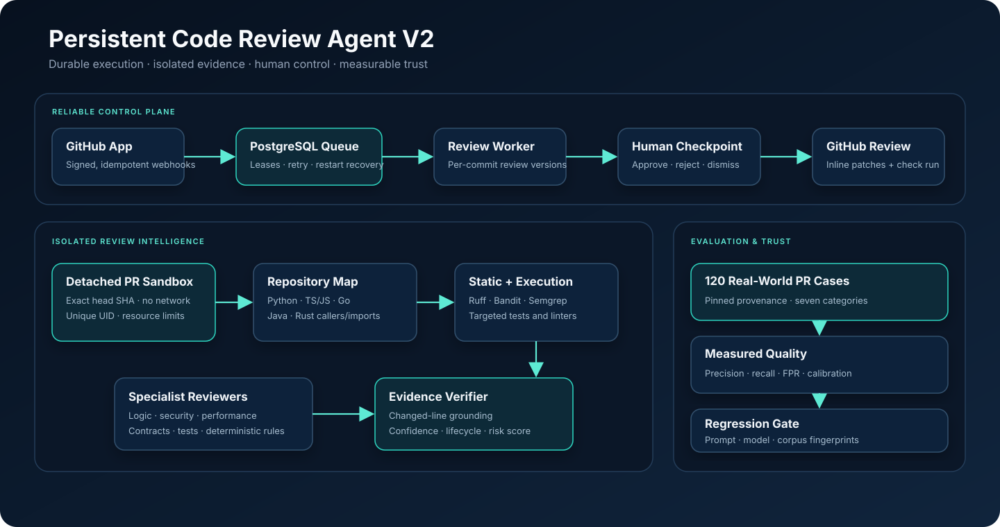

<div align="center">

# Persistent Code Review Agent V2

### Evidence-backed pull-request reviews that survive failures, understand impact, and improve with feedback.

[](https://github.com/aayush1234434-stack/Persistent-Code-Review-Agent-/actions/workflows/ci.yml)


[Product preview](https://aayush1234434-stack.github.io/Persistent-Code-Review-Agent-/) ·
[Architecture](docs/architecture.svg) ·
[Evaluation report](https://aayush1234434-stack.github.io/Persistent-Code-Review-Agent-/benchmark-report.html) ·
[Quick start](#quick-start)

</div>

---

Persistent Code Review Agent is a production-oriented AI review platform for GitHub pull requests. It combines LLM reasoning with deterministic checks, repository-aware impact analysis, isolated execution, human approval, and measurable quality gates.

It is built around a simple principle: **a finding should not be published merely because a model generated it.** It should be grounded in the diff, supported by static or execution evidence when possible, and remain auditable across review versions.

> [!IMPORTANT]
> The 120-case real-world evaluation harness is implemented and reproducible. The checked-in baseline currently validates the corpus, prompts, models, and scoring contract; measured model-quality results remain intentionally unpublished until the complete authenticated run is accepted.

## Why this is different

| | Capability | What it means in practice |
|---|---|---|
| 🧱 | **Durable by design** | PostgreSQL jobs, renewable leases, idempotent webhooks, bounded retries, and restart recovery. |
| 🧠 | **Repository-aware** | Reviews changed files, symbols, imports, reverse dependencies, and callers instead of treating a diff as isolated text. |
| 🔬 | **Evidence first** | Combines Ruff, Bandit, Semgrep, targeted tests, deterministic checks, and changed-line grounding. |
| 🔐 | **Isolated execution** | Runs repository commands with no network, a unique unprivileged UID, resource limits, and no application secrets. |
| 💬 | **Developer friendly** | Produces inline GitHub comments, suggested patches, “why this matters,” lifecycle state, and one-click reruns. |
| 📊 | **Measurable trust** | Tracks precision, recall, false positives, calibration, latency, cost, and human acceptance. |

## Architecture



```text
GitHub webhook
    │
    ▼
Idempotent ingestion ──► PostgreSQL durable queue ──► leased worker
                                                        │
                                                        ▼
                                             isolated PR checkout
                                                        │
                             ┌──────────────────────────┼──────────────────────────┐
                             ▼                          ▼                          ▼
                    symbol/dependency map       static analysis              targeted tests
                             └──────────────────────────┼──────────────────────────┘
                                                        ▼
                                            LLM + deterministic review
                                                        │
                                                        ▼
                                              evidence/grounding gate
                                                        │
                                                        ▼
                                            human approval + GitHub review
```

## Core capabilities

### Reliable platform

- Durable PostgreSQL queue using `FOR UPDATE SKIP LOCKED`
- Renewable worker leases with recovery after process or database restarts
- Idempotent webhook handling using GitHub delivery IDs or signed-payload hashes
- Monotonic review versions keyed by repository, PR number, and source SHA
- Exponential retry/backoff with explicit terminal failure state
- Transactional approvals, review decisions, and finding feedback
- Fail-fast production startup when persistence or isolation is unavailable

### Review intelligence

- Isolated checkout of the exact PR head SHA
- Changed-symbol, import, reverse-dependency, and caller analysis
- Impact-scoped Ruff, Bandit, offline Semgrep, and test execution
- Static findings restricted to changed files and verified against changed lines
- Execution output attached as corroborating evidence
- Structured regression-test suggestions for changed symbols and findings
- Language-aware repository maps for Python, JavaScript/TypeScript, Go, Java, and Rust

| Language | Symbols | Imports/dependencies | Caller discovery |
|---|:---:|:---:|:---:|
| Python | ✅ | ✅ | ✅ |
| JavaScript / TypeScript | ✅ | ✅ | ✅ |
| Go | ✅ | ✅ | ✅ |
| Java | ✅ | ✅ | ✅ |
| Rust | ✅ | ✅ | ✅ |

### Developer experience

- Inline GitHub comments with native suggested-patch blocks
- Concise “why this matters” explanations
- One-click review of the latest commit
- Finding lifecycle: **new**, **recurring**, **fixed**, and **dismissed**
- File-level risk heatmaps and previous-version risk comparisons
- Engineering-manager summaries covering scope, tests, and priority risks
- Persistent reviewer feedback that influences later review versions

### Evaluation and trust

- Versioned corpus of 120 human-reviewed public pull requests
- Precision, recall, F1, and false-positive rate by issue category
- Strict sparse-label scores plus independent adjudication of unmatched findings
- Confidence calibration curves, Brier score, and expected calibration error
- Time-to-review, estimated cost per PR, and human acceptance telemetry
- Prompt, schema, model-policy, pricing, and corpus fingerprints
- Regression gates for every prompt or default-model policy change

## Example review

Given this change:

```diff
+ existing = Refund.objects.get(idempotency_key=request.key)
+ return existing.to_response()
```

The review can produce:

```text
HIGH · SECURITY · confidence 0.94

Idempotency key lookup crosses the tenant authorization boundary.

Why this matters:
Another tenant that learns a valid key could retrieve refund state before
ownership is verified.

Evidence:
- Exact changed line
- Repository caller context
- Static-analysis result

Suggested patch:
existing = Refund.objects.get(
    tenant=request.tenant,
    idempotency_key=request.key,
)
```

## Quick start

### Requirements

- Python 3.11+
- Docker with Compose
- A PostgreSQL database for non-Docker local development
- GitHub and OpenAI credentials for live reviews

### Run the complete stack with Docker

```bash
git clone https://github.com/aayush1234434-stack/Persistent-Code-Review-Agent-.git
cd Persistent-Code-Review-Agent-
cp .env.example .env
```

Fill in the required values in `.env`, then start the stack:

```bash
docker compose up --build
```

| Surface | URL |
|---|---|
| Review dashboard | `http://localhost:8000/dashboard` |
| Health check | `http://localhost:8000/healthz` |
| Readiness check | `http://localhost:8000/readyz` |
| Prometheus metrics | `http://localhost:8000/metrics` |
| GitHub webhook | `POST http://localhost:8000/github/webhook` |

### Run locally

```bash
python3 -m venv .venv
source .venv/bin/activate
pip install -r requirements.txt -r requirements-analysis.txt
cp .env.example .env
uvicorn main:app --reload --host 0.0.0.0 --port 8000
```

The API applies database migrations during startup. To run the web service and worker separately, set `REVIEW_WORKER_ENABLED=false` for the API and launch:

```bash
python worker.py
```

> [!NOTE]
> Local mode does not execute repository tests unless `REVIEW_ALLOW_LOCAL_TEST_EXECUTION=true`. Production requires `REVIEW_SANDBOX_MODE=filesystem`; Docker Compose configures the isolated mode automatically.

<details>
<summary><strong>Important configuration</strong></summary>

| Variable | Purpose | Default |
|---|---|---|
| `ENVIRONMENT` | Enables development or production startup policy | `development` |
| `DATABASE_URL` | PostgreSQL persistence and durable queue | — |
| `GITHUB_WEBHOOK_SECRET` | Validates webhook signatures | — |
| `GITHUB_TOKEN` | Fetches PR metadata and publishes reviews | — |
| `OPENAI_API_KEY` | Enables live LLM review nodes | — |
| `DASHBOARD_API_KEY` | Protects review actions | — |
| `REVIEW_WORKER_ENABLED` | Runs the embedded worker | `true` |
| `REVIEW_SANDBOX_MODE` | `local` or isolated `filesystem` execution | `local` |
| `REVIEW_JOB_MAX_ATTEMPTS` | Maximum queue attempts before terminal failure | `5` |
| `REVIEW_RETAIN_SANDBOX` | Retains isolated workspaces for debugging | `false` |

See [.env.example](.env.example) for the complete configuration surface.

</details>

## Review lifecycle

1. GitHub sends a signed pull-request webhook.
2. The API stores the delivery and review job transactionally.
3. A worker claims the job with a renewable lease.
4. The PR head is fetched into a unique workspace.
5. Repository intelligence selects changed and impacted code.
6. Static tools and targeted tests run inside the no-network sandbox.
7. LLM and deterministic findings pass through an evidence gate.
8. A reviewer approves, rejects, requests changes, or dismisses findings.
9. Approved findings are published as inline GitHub review comments.
10. New commits create a new version while preserving finding history.

## Testing

Run the unit and API suite:

```bash
pytest -q
```

Run the fast deterministic benchmark:

```bash
python benchmarks/pr_review_benchmark.py
```

Validate the 120-case corpus and evaluation contract without an LLM call:

```bash
python benchmarks/evaluate.py \
  --validate-only \
  --contract benchmarks/baselines/evaluation_contract.v1.json
```

Run the real PostgreSQL restart and isolated-sandbox integration checks:

```bash
docker compose up --build -d db sandbox
python scripts/test_postgres_restart_recovery.py
docker compose run --rm worker python scripts/test_sandbox_roundtrip.py
docker compose down --volumes --remove-orphans
```

These integration checks are also enforced by the `docker-recovery` CI job.

<details>
<summary><strong>Run the complete live 120-case evaluation</strong></summary>

This run uses paid model API calls and requires a configured `OPENAI_API_KEY`.

```bash
python benchmarks/run_live_benchmark.py \
  --output benchmark-results/predictions.jsonl

python benchmarks/adjudicate_sparse_labels.py \
  --predictions benchmark-results/predictions.jsonl \
  --output benchmark-results/adjudicated-predictions.jsonl

python benchmarks/evaluate.py \
  --predictions benchmark-results/adjudicated-predictions.jsonl \
  --contract benchmarks/baselines/evaluation_contract.v1.json \
  --output-json benchmark-results/report.json \
  --output-markdown benchmark-results/report.md \
  --output-html docs/benchmark-report.html
```

The manual **Live 120-PR Evaluation** workflow retains raw predictions and reports for 90 days and publishes the accepted HTML report to GitHub Pages.

</details>

## Security model

The analysis container is intentionally treated as hostile:

- No network interface beyond loopback
- No GitHub token, OpenAI key, or dashboard secret
- Unique unprivileged UID for each review request
- CPU, memory, file-size, file-descriptor, process-count, and wall-clock limits
- Read-only container filesystem with a dedicated shared workspace volume
- Dropped Linux capabilities for the child process
- Offline Semgrep rules with telemetry disabled
- Workspace deletion after analysis unless explicitly retained

The sandbox supervisor receives only the capabilities needed to prepare a child-owned workspace. The review command drops privileges before executing repository code.

## Project map

```text
.
├── main.py                    # FastAPI service, webhooks, review API
├── worker.py                  # Standalone durable worker
├── agent.py                   # Review graph, prompts, ranking, grounding
├── review_queue.py            # PostgreSQL jobs, leases, retries, migrations
├── review_intelligence.py     # Checkout, symbol map, tools, evidence
├── sandbox_service.py         # No-network command supervisor
├── evaluation.py              # Quality, calibration, latency, cost metrics
├── dashboard.html             # Human review dashboard
├── migrations/                # Versioned PostgreSQL schema
├── benchmarks/                # Fast and 120-case evaluation suites
├── scripts/                   # Recovery and isolation integration checks
├── tests/                     # Unit and API tests
├── docs/                      # Product preview, architecture, report
└── .github/workflows/         # CI, live evaluation, GitHub Pages
```

## API highlights

| Endpoint | Purpose |
|---|---|
| `GET /reviews` | List review runs |
| `GET /reviews/{id}` | Inspect a review and its findings |
| `GET /reviews/{id}/history` | Compare review versions |
| `GET /reviews/{id}/manager-summary` | Retrieve the manager-focused summary |
| `POST /reviews/{id}/rerun-latest` | Queue the latest PR commit |
| `POST /reviews/{id}/approve` | Transactionally approve a review |
| `POST /reviews/{id}/findings/{index}/feedback` | Record finding feedback |
| `GET /evaluation/metrics` | Aggregate latency, cost, and acceptance |

## Current roadmap

- Publish the first accepted authenticated 120-case model-quality baseline
- Add deeper parser adapters and dependency-ecosystem intelligence
- Add hosted organization-level review history and benchmark trends

## Author

Built by **Aayush Singh**.

If this project is useful, consider starring the repository or opening an issue with a real review scenario you would like added to the benchmark.
